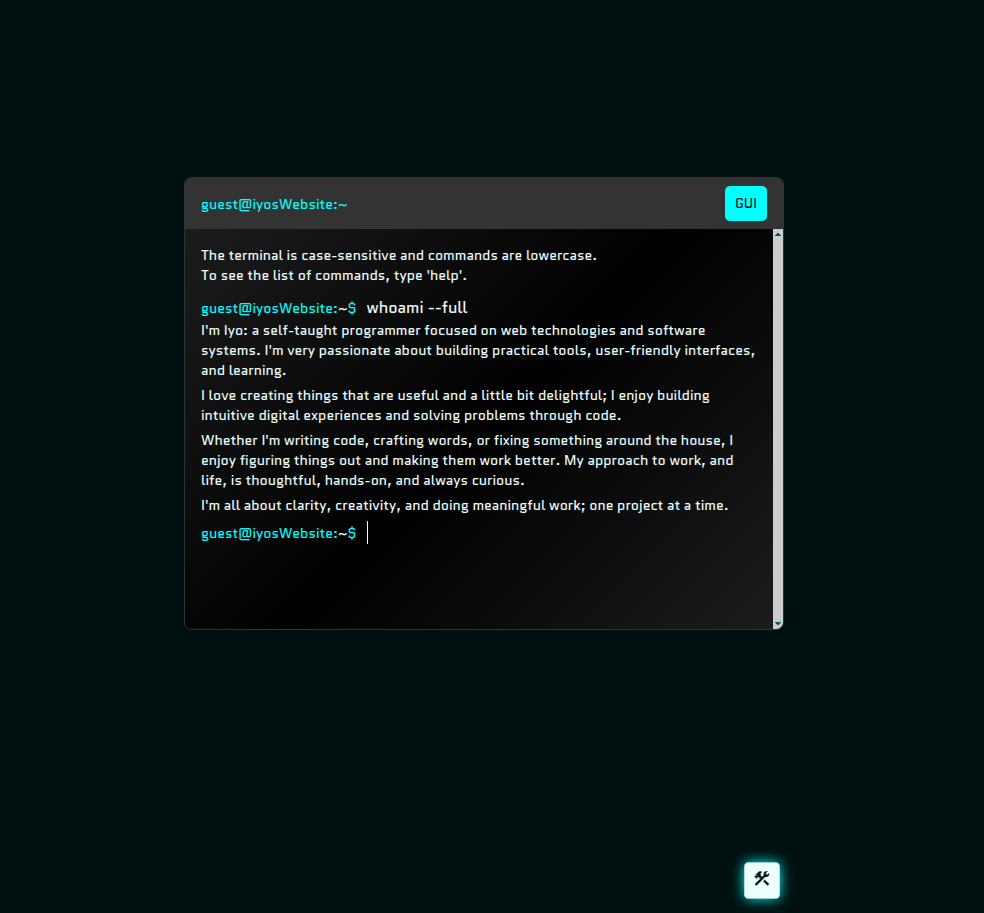
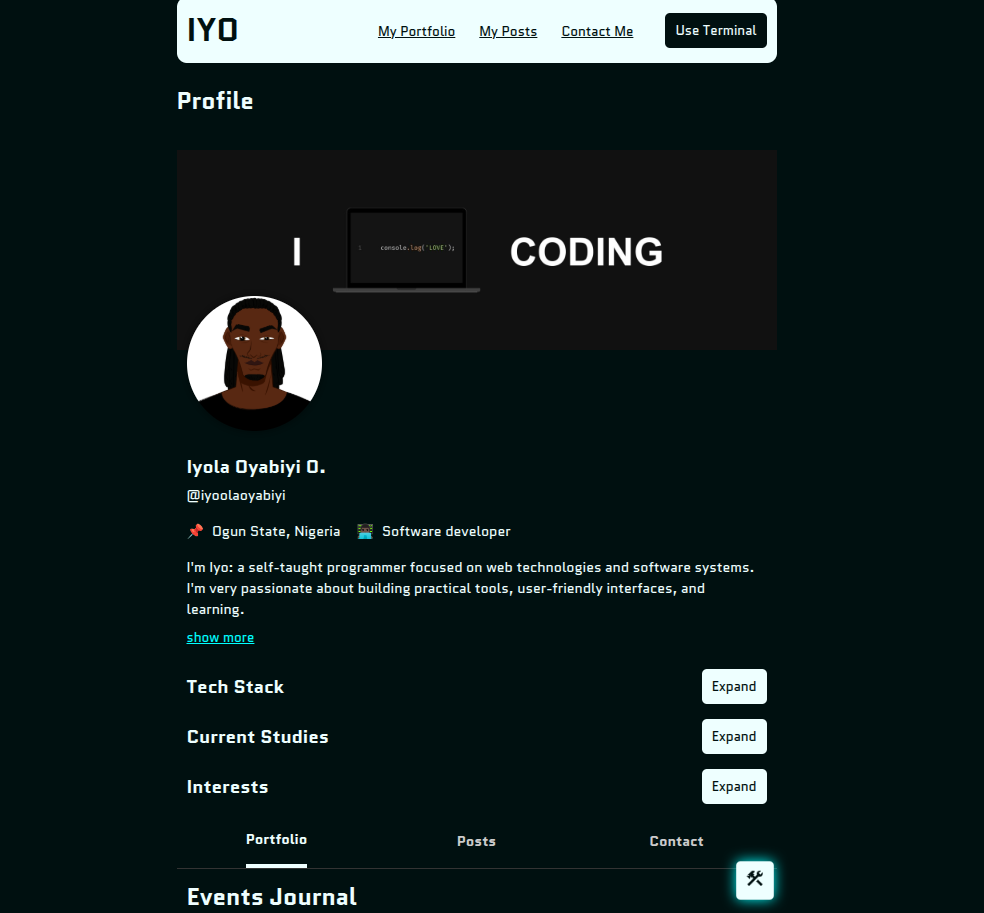

# Iyo's Portfolio Website

> A playful and interactive portfolio site that mimics a terminal environment — with a GUI fallback — to explore my work, skills, and thoughts.

---

**Welcome to my terminal-inspired personal website!**  
Unlike traditional scrolling portfolios, this site invites users to _explore_, _navigate_, and _type_ their way around via a simulated shell.

---

## 🔗 Quick Access

- **Live Demo**: [iyoolaoyabiyi.github.io](https://iyoolaoyabiyi.github.io)

---

This portfolio breaks away from the typical “scrolling” personal website. Instead, it offers a **playful, interactive terminal experience** where visitors explore a mini terminal-like environment to learn about my work and background.

It's not just a website; it's a concept that speaks to **creativity, technical fluency, and personality**.

## Key Concept

Visitors essentially "play" with a simulated command-line interface to:
- Run commands
- Navigate a virtual filesystem
- Access data like `portfolio`, `contact`, and more

It's delightful for tech-savvy users, hopefully **memorable for recruiters**, and surprisingly fun for casual visitors.

For those who don’t have time or get confused by typed commands, a helpful `help` command and **GUI switch** make sure everyone can quickly find the info they need.

---

## Features

- **Terminal interface** with responsive commands
- **GUI alternative** for quick access
- **Virtual filesystem** for realistic directory navigation
- Built-in commands: `echo`, `list`, `goto`, `open`, `clear`, `exit`, `help`, etc
- **Modal welcome** to orient first-time users

---

## Commands

| Command | Description | Usage |
| --- | --- | --- |
| `calculate`, `calc` | Evaluates an arithmetic expression | `calculate EXPRESSION` |
| `clear` | Clears terminal screen | `clear` |
| `echo`, `write` | Displays a line of text | `echo [TEXT]` |
| `exit`, `quit` | Simulates exiting the terminal | `exit` |
| `goto`, `cd` | Changes directory | `goto DIRECTORY` |
| `help` | Displays available commands and descriptions or help for a command | `help [COMMAND]` |
| `list`, `ls` | Lists current directory contents | `list [DIRECTORY]` |
| `open`, `cat` | Displays contents of a file | `open FILE` |
| `tech-stack` | Displays tools, languages, or frameworks Iyo uses | `tech-stack [--list] [LIST]` |
| `username` | Gets or sets the current username | `username [NEW USERNAME]` |
| `visit` | Opens a provided URL in a new browser tab | `visit URL` |
| `whoami` | Shows a short description or full profile | `whoami [--full]` |

And more

---

## Tech Stack

- Pure **HTML**, **CSS (SCSS)**, and **JavaScript**
- No frameworks
- Self-contained logic, virtual state, and command parsing

---

## Demo

[Iyo's Portfolio Website](https://iyoolaoyabiyi.github.io)

---

## Screenshots

---

## Author

**Oyabiyi Iyola**  
GitHub: [@iyoolaoyabiyi](https://github.com/iyoolaoyabiyi)

---
